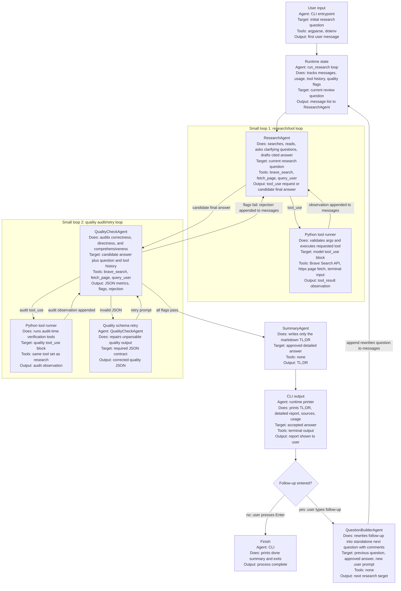

# Agent Flow

This diagram shows the full runtime path from the initial user question through
tool use, quality review, summarization, and optional follow-up research.

## Agent Targets And Outputs

| Step | Agent | Target | Tools | Output destination |
| --- | --- | --- | --- | --- |
| Input setup | CLI entrypoint and `run_research` | User's starting question | `argparse`, `.env` loading | Initial `messages` list |
| Research/tool loop | `ResearchAgent` | Current research question | `brave_search`, `fetch_page`, `query_user` | Tool calls go to `run_tool`; candidate answers go to quality review |
| Tool execution | Python tool runner | Model `tool_use` arguments | Brave Search API, `httpx`, terminal input | `tool_result` observations appended to the message list |
| Quality audit loop | `QualityCheckAgent` | Candidate answer, target question, and tool history | Same three tools when verification helps | Structured quality JSON |
| Rejection path | `run_research` | Failed quality flags and rejection text | Message append | Rejection returns to `ResearchAgent` for another draft |
| Acceptance path | `SummaryAgent` | Approved detailed answer | None | Markdown TL;DR |
| User-visible output | CLI printer | Accepted answer and summary | Terminal output | TL;DR, final cited report, usage summary |
| Follow-up path | `QuestionBuilderAgent` | Prior question, approved answer, and new prompt | None | New standalone research question appended to `messages` |
